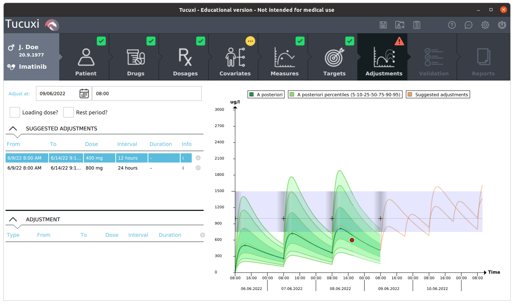

Tucuxi-core
===========

Description
-----------

Tucuxi is a software for clinical pharmacology and specifically for Therapeutic Drug Monitoring (TDM) and Model Informed Precision Dosing (MIPD), able to compute drug concentration predictions based on the patient's data (dosage history, covariates, blood sample measurements). Tucuxi offers a graphical user interface, and is built on top of a computing engine.

Tucuxi can be accessed from http://www.tucuxi.ch , and a separate repo will contain the source code of the GUI.

This repo contains the computing engine, called Tucuxi-core. It is obviously at the heart of the GUI software, but can be used differently. In this repo there is a command line tool that allows to do computations thanks to an XML input format and and XML output format. There is also a REST server source code, that accepts the same XML as the command line.

A python interface is part of another repo, and will be available soon.

Getting started
---------------

Test and Deploy
---------------

Dependencies
------------

Tucuxi-core takes advantage of other Open Source projects:

- boost 1.83
- botan 2.19.3
- cxxopts
- date
- eigen 3.3.8
- fructose 1.3
- rapidxml
- rapidjson
- spdlog
- TinyJS

Currently, the useful code is embedded within our repo, except for date. It may change in the future.

Compilation
-----------

Tucuxi-core has a long history, and so its compilation tools history. It currently shows various options. The main flow involves ``qmake``, as the GUI has been developed with Qt. Therefore we encourage you to use ``qmake`` for managing the builds. There are also some ``cmake`` configuration files, but they are not up to date and would require some work to be fully usable.

Also, there is homemade build system, which is currently only used to build libraries. It means, that you first have to build the libs, by executing, in ``<tucuxi-core_git>/make``:

For Linux and MacOS:

.. code-block:: bash

    ./build.sh libs

For Windows (it has to be checked):

.. code-block:: bash

    ./build.bat libs

Then you are ready for compilation of some of the applications, command line interface, drug file checker, drug file validator, tests.

Compilation of the command line interface
^^^^^^^^^^^^^^^^^^^^^^^^^^^^^^^^^^^^^^^^^

For compilation of *tucucli*, go into the ``<tucuxi-core_git>/make/qtcreator/tucucli`` directory, and run the command:

.. code-block:: bash

  qmake

Or go anywhere, and run:

.. code-block:: bash

  qmake <tucuxi-core_git>/make/qtcreator/tucucli/tucucli.pro

Compilation of tucudrugfilechecker
^^^^^^^^^^^^^^^^^^^^^^^^^^^^^^^^^^

For compilation of *tucudrugfilechecker*, go into the ``<tucuxi-core_git>/make/qtcreator/tucudrugfilechecker`` directory, and run the command:

.. code-block:: bash

  qmake

Or go anywhere, and run:

.. code-block:: bash

  qmake <tucuxi-core_git>/make/qtcreator/tucudrugfilechecker/tucudrugfilechecker.pro

Compilation of tucuvalidator
^^^^^^^^^^^^^^^^^^^^^^^^^^^^

For compilation of *tucuvalidator*, go into the ``<tucuxi-core_git>/make/qtcreator/tucuvalidator`` directory, and run the command:

.. code-block:: bash

  qmake

Or go anywhere, and run:

.. code-block:: bash

  qmake <tucuxi-core_git>/make/qtcreator/tucudrugfilechecker/tucuvalidator.pro

Compilation of the tests
^^^^^^^^^^^^^^^^^^^^^^^^

Various unit and integration tests are available, namely:
- tucutestcommon
- tucutestcore
- tucutestquery

For each of these test, you can compile it by going into the ``<tucuxi-core_git>/make/qtcreator/<testname>`` directory, and run the command:

.. code-block:: bash

  qmake

Or go anywhere, and run:

.. code-block:: bash

  qmake <tucuxi-core_git>/make/qtcreator/<testname>/<testname>.pro

Usage
-----

The command line interface, tucucli, can be used to perform computations, by supplying XML inputs containing the patient's dosage history, covariates, blood concentrations, and data about what kind of computation should be executed. Documentation will be available soon. In the meantime, run

.. code-block:: bash

    tucucli --help

to get some help.

The drug file checker, tucudrugfilechecker, is a software meant to check if a Tucuxi drug file is valid or not. Supplying a drug file as an input will end up with an extended check of it, with results explaining what issues are found in the file. Documentation will be available soon. In the meantime, run

.. code-block:: bash

    tucudrugfilechecker --help

to get some help.

The tests can be run directly, and will display meaningful messages if something goes wrong.

To use the code directly, it can be embedded in any C++ source code, or embedded in python, thanks to a pybind11 project (soon to be released).

Support
-------

For now on, feel free to contact yann.thoma@heig-vd.ch for support.

Roadmap
-------

Except small improvements added when required, the computing engine does not accept multi-analytes drugs. Support for such multi-analytes substances require some huge modifications, and is the main addition to be thought for the future.

Contributing
------------

Until now, the development has been managed and done by the REDS institute, at HEIG-VD. As a now Open Source project, we are now happy to welcome contributors.

In the <tucuxi-core> folder, there is a ``.clang-format`` file that ensures the code follows the Tucuxi coding standard. You can use ``clang-format`` to check your code is compliant, and the same tool to automatic format it correctly by running the following command in the source or test folder (for Linux users):

.. code:: bash

    find . -regex '.*\.\(cpp\|hpp\|cc\|cxx\|h\)' -exec clang-format -style=file -i {} \;

Authors and acknowledgment
--------------------------

Tucuxi-core is maintained by Yann Thoma, but the list of current and past developers on this project throughout the years is quite long, but here are the main ones to mention:

- Robert Hooper
- Yannis Jeannotat
- Jean-Rémi Péclard
- Roberto Rigamonti
- Johan Matthey
- Julien Rosset

Also, people at the CHUV hospital have been contributing with their insights:

- Thierry Buclin
- Chantal Csajka
- Monia Guidi

Finally, a current collaboration with CHU-Lyon helps making this code base evolve, thanks to:

- Sylvain Goutelle

License
-------

Tucuxi-core is released under the AGPLv3 license. Contributors are encouraged to participate to this project, under the terms of this Open source license.

Project status
--------------

The project is under development, following the aforementioned roadmap, and fixing issues when required. Feel free to contact the development team if you discover something that could be useful.
